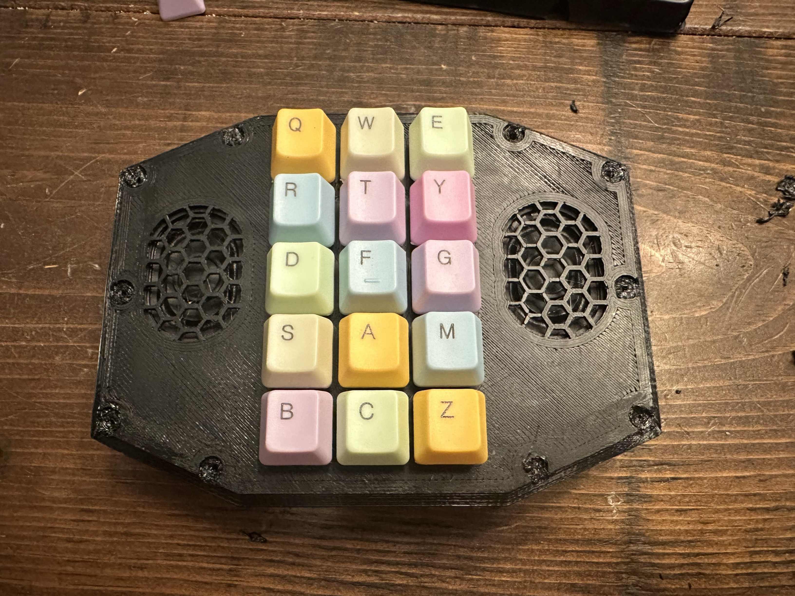
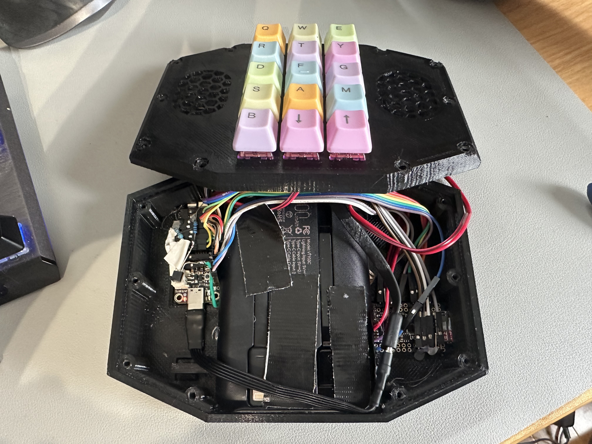
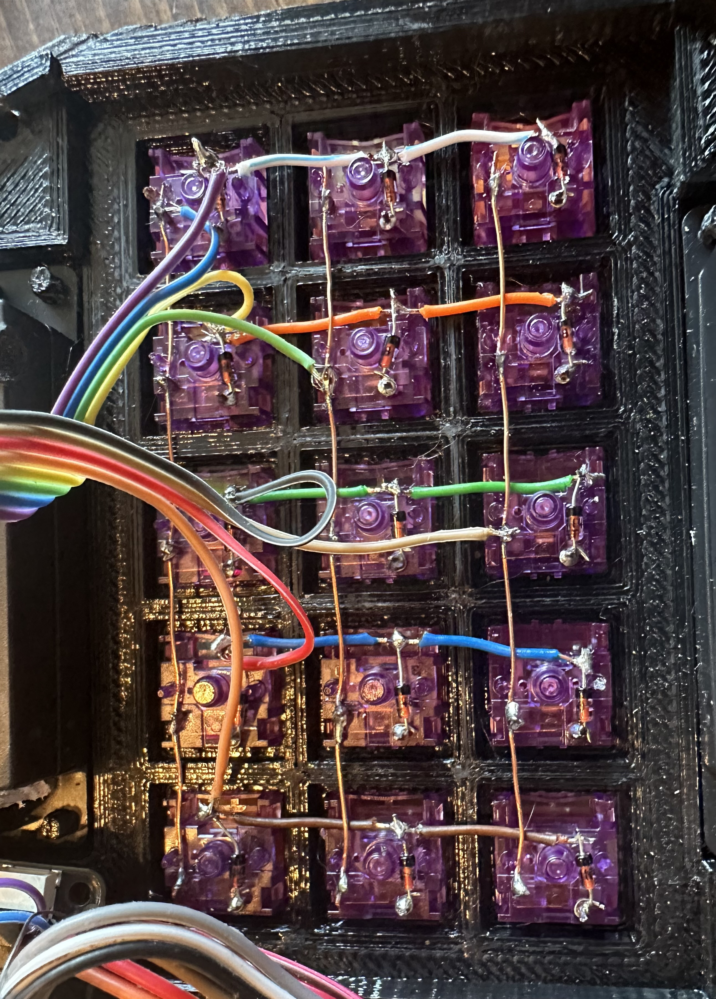
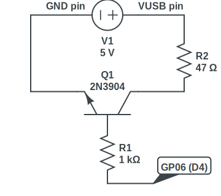

# Sophie's First Music Player

This repository contains the design files and source code for Sophie's First Music Player, a custom-built music player designed for children.

## Contents

- [`Sophie's First Music Player.f3d`](Sophie's%20First%20Music%20Player.f3d): Fusion 360 model file
- [`sophies-first-music-player.ino`](sophies-first-music-player.ino): Arduino IDE source code
- [`case.stl`](case.stl): 3D printable file for the case
- [`top.stl`](top.stl): 3D printable file for the top

## Hardware

The music player is built using the following main components:

1. [Adafruit Feather RP2040](https://www.adafruit.com/product/4884): The main microcontroller board.
2. [Adafruit Music Maker FeatherWing w/ Amp](https://www.adafruit.com/product/3436): For audio processing and amplification.
3. [Stereo Enclosed Speaker Set - 3W 4 Ohm](https://www.pishop.ca/product/stereo-enclosed-speaker-set-3w-4-ohm/): speakers
4. Cherry MX Switches and Keycaps: Standard mechanical keyboard switches and keycaps for the buttons.
5. [WeeFancy Mini Portable Charger](https://www.amazon.ca/dp/B0CMTMRDQS): A 10000mAh battery pack for power.
6. [10cm flat male to female usb-c cable](https://www.aliexpress.com/item/1005005371248824.html?spm=a2g0o.order_list.order_list_main.11.76501802kebAYZ)
7. 15x 1N4148 diodes for the keyboard matrix
8. Keep-alive circuit: 1x 1kohm 1/4w resistor, 1x 47ohm 1w resistor, 1x 2N3904 NPN transistor
7. A mini sdcard
8. Small gauge wire (I mainly used a combination of straight and 90° headers with female-female wires)

## Design

### Case Design

### Top Design

### Assembled Device

### Internal Components

### Keyboard matrix

## Usage

- Each button plays a specific song.
- On the SD card, files have to be named `1 - mysong.mp3`, `2 - another song.mp3`, `15 - lastsong`, etc.
- The first button on the last row acts as a shift key:
  - When shift is held, the next two buttons function as volume down and up, respectively.
- Power on/off is controlled by the push-button on the back of the device.

## Keep-Alive Circuit

To prevent the power bank from automatically shutting off due to low current draw, a keep-alive circuit is implemented:

This circuit periodically sends a pulse of current to the power bank, simulating device activity. This ensures that the power bank remains on even when the music player is idle for extended periods.

Key features of the keep-alive circuit:
- Uses a GPIO pin to control a transistor
- Sends a brief pulse every 20 seconds
- Consumes minimal power when not active
- Ensures uninterrupted power supply for the music player

The keep-alive functionality is implemented in the Arduino code, allowing for easy adjustment of the pulse frequency and duration if needed.

## License

This project is licensed under the MIT License - see the [LICENSE](LICENSE) file for details.
